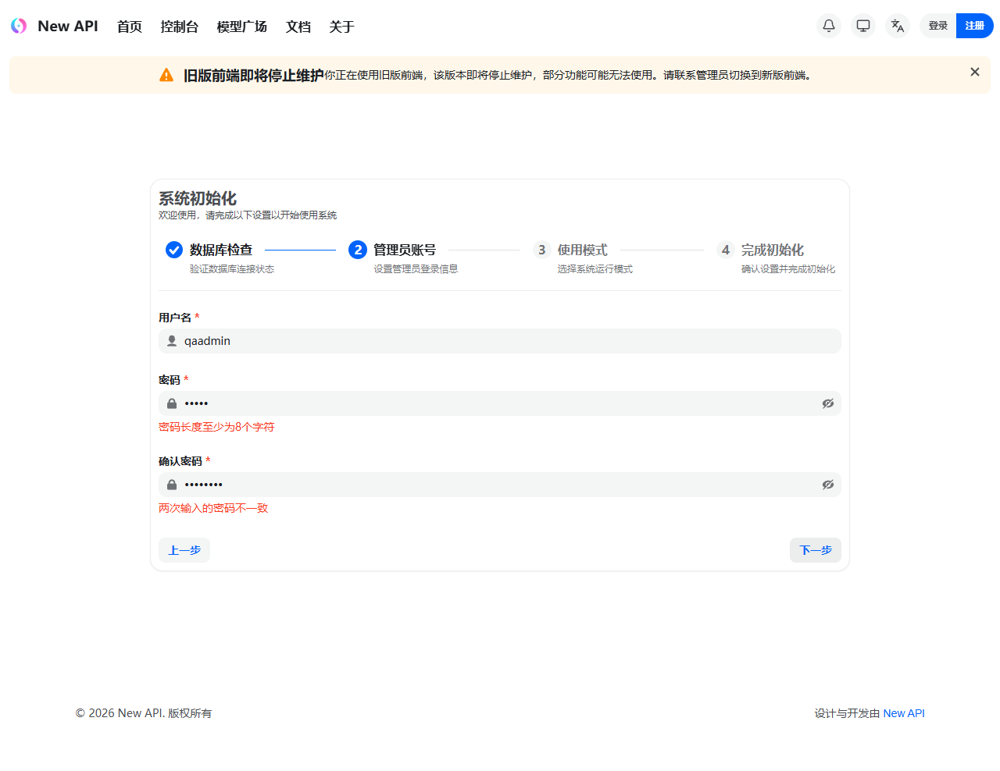

# 本地 Compose 与分支验收报告

## 结论

验收通过。`codex/local-compose-build` 的本地 MySQL Compose 实现已提交并合并到实际存在的 `docs/ark-native-compat-plans` 分支。最终分支镜像已在本机构建，MySQL、Redis 和 new-api 三个服务均为 `healthy`，API 状态接口返回 HTTP 200，最终镜像已完成一轮 Playwright 浏览器验收。

本次没有完成系统初始化，没有创建管理员账号，也没有调用真实 Dimensio 上游。

## 分支与提交

- 目标分支：`docs/ark-native-compat-plans`
- 跟踪分支：`fork/docs/ark-native-compat-plans`
- 跟踪基线：`b97718ceeeb829e2c37eda494f242c1f3fcb3fd1`
- 合并前功能 HEAD：`821346326f3ca0d5c9bbac92c1fe71ad7d7e7ed8`
- Compose 实现提交：`78b9460df`、`96ce875ad`
- Compose 合并提交：`008bd69d0`
- 本报告提交前差异：ahead 28 / behind 0，83 个文件，`+6624/-730`

本地分支在报告提交前包含以下 28 个提交：

1. `e23ea6356` docs(billing): design per-duration model pricing
2. `cf1462834` docs(billing): plan per-duration model pricing
3. `bb5be15b2` feat(billing): add validated duration price settings
4. `825614c16` fix(billing): synchronize duration pricing config
5. `c5e04d2c3` fix(setting): preserve atomic map config updates
6. `bff6a0db8` feat(billing): calculate task prices by duration
7. `7f6cb2bd5` fix(billing): preserve fractional quota units
8. `3d6daa99c` feat(dimensio): use explicit duration billing
9. `df9c77261` feat(billing): snapshot duration task charges
10. `97300b959` docs: design local compose build
11. `09eb6531a` feat(billing): expose duration model prices
12. `459b68537` feat(web): persist per-duration model prices
13. `92b4aa513` docs: plan local MySQL compose build
14. `ced1a3a4a` fix(web): preserve duration pricing ratios
15. `5ca067fcf` chore: ignore local worktrees
16. `0fda42de3` fix(web): preserve legacy pricing semantics
17. `56effb89c` feat(web): edit per-duration model pricing
18. `30da8026e` fix(web): validate duration price input
19. `f73314c50` fix(web): polish duration pricing editor
20. `e3147f15b` feat(web): display duration-based model prices
21. `e47572aa4` fix(web): correct duration price displays
22. `b7da4c446` test(dimensio): accept per-duration Seedance billing
23. `389504405` fix(dimensio): align acceptance evidence
24. `78eb597e6` fix(billing): address per-duration verification findings
25. `821346326` fix(billing): preserve duration pricing on ratio adjustment
26. `78b9460df` chore: add local compose build
27. `96ce875ad` fix: harden local compose defaults
28. `008bd69d0` merge: add local MySQL compose stack

## 改动范围

- 时长计费配置：新增 `per_duration` 模式、结构化 `DurationPrice`、默认 Dimensio 规则、输入校验和并发安全配置更新。
- 额度与账本：使用 Decimal 计算时长费用，保留小数额度，执行饱和保护，并在任务、消费和退款日志中冻结计费快照。
- Dimensio Relay：使用源模型查价、映射模型请求上游，验证 4-15 秒时长及模型/分辨率矩阵，并按请求时长结算。
- API 与同步：模型目录暴露计费模式与时长规则，上游同步按结构化规则处理，避免错误使用固定 `model_price`。
- 管理前端：支持时长计费编辑、校验、预览、保存、删除、批量复制和计费模式切换。
- 公开前端：支持时长标识、单位价格、筛选、每秒归一化排序、卡片/表格/详情展示和无效规则降级。
- i18n 与可访问性：六个 locale 增加时长计费文案，视图切换控件增加独立可访问名称。
- 本地容器：新增 `docker-compose.local.yml`，从本地源码构建完整镜像，使用 MySQL 8.2 和 Redis 7，并默认仅绑定 `127.0.0.1`。

## 验收清单

### 自动化已完成

- [x] Compose 渲染配置通过：`docker compose -f docker-compose.local.yml config --quiet`。
- [x] 完整目标分支镜像构建通过，包含默认前端、Classic 前端缓存层和 Go 二进制。
- [x] 最终镜像为 `new-api:local`，ID `sha256:bdf6fe1fff2b574417e3d3a195ec1c19a8d73a099b4f8c6913f626dff370bbc7`。
- [x] MySQL、Redis、new-api 均为 `healthy`，重启次数为 0。
- [x] `http://127.0.0.1:3000/api/status` 返回 HTTP 200 且 `success=true`。
- [x] 全量 Go 测试通过：`go test ./... -count=1`，包括 `e2e`。
- [x] 核心包聚焦测试通过：billing setting、config、types、service、Dimensio adaptor、relay common/helper。
- [x] 聚焦 E2E 通过：时长模式、参考时长和 Dimensio Seedance 2.0 生命周期。
- [x] 首次访问根路径自动进入 `/setup`，页面标题为 `New API`。
- [x] 初始化页正确识别当前数据库为 MySQL。
- [x] 可从数据库检查进入管理员账号步骤。
- [x] 管理员表单阻止少于 8 位密码，并阻止两次密码不一致。
- [x] 浏览器验收未提交初始化表单，未写入测试管理员数据。

### 仍需人工或外部环境

- [ ] 使用真实 Dimensio API Key 验证媒体抓取、生成结果、points 扣减、真实错误码和结果 URL 有效期。
- [ ] 完成初始化后，在管理端人工复验时长价格新增、编辑、复制、删除和计费模式切换。
- [ ] 完成初始化后，在公开模型目录人工复验时长筛选、每秒归一化排序和多货币/分组价格展示。
- [ ] 在主机安装 Bun 后运行独立前端 `bun test`、`bun run typecheck`、`bun run lint`、`bun run format:check` 和 `bun run i18n:sync`；本次主机没有 Bun，生产前端构建已在 Docker 的 Bun 阶段通过。
- [ ] 使用 MySQL 自定义密码和固定 `SESSION_SECRET` 重新启动，验证已有数据库卷和持久会话场景。

## Docker 证据

- 最终构建分支：`docs/ark-native-compat-plans@008bd69d0`
- 镜像创建时间：`2026-07-20T07:43:14.354737032Z`
- 绑定地址：`127.0.0.1:3000->3000/tcp`
- MySQL 数据卷：`local_mysql_data`
- 应用启动耗时：约 699 ms
- 最终应用日志未发现可执行的启动错误。

首次构建曾分别遇到 `deb.debian.org` DNS 解析失败和 `proxy.golang.org` 模块下载 `unexpected EOF`。容器 DNS/HTTP 检查通过后，未修改源码的缓存重试构建成功。这两次失败归类为瞬时外部网络问题。

## 浏览器证据

Playwright CLI 在最终镜像上执行了以下流程：

1. 打开 `http://127.0.0.1:3000`，确认重定向到 `/setup`。
2. 读取语义快照，确认 MySQL 数据库状态成功。
3. 点击“下一步”进入管理员账号表单。
4. 输入短密码和不一致确认密码，确认字段进入 invalid 状态并显示两条校验消息。
5. 关闭浏览器，不完成初始化。



## 已知边界

- 默认端口只监听 loopback；需要局域网访问时必须显式调整 Compose 配置并配置安全会话密钥。
- `SESSION_SECRET` 默认留空，由应用在每次启动时随机生成；需要跨重启保持会话时必须通过环境变量提供固定随机值。
- Redis 是可重建缓存，虽然启用 AOF，但当前 Compose 未为 Redis `/data` 配置持久卷。
- 时长计费当前只有 Dimensio 实现 `TaskDurationEstimator`；其他 provider 配置为 `per_duration` 会返回不支持错误。
- 默认时长规则只覆盖已配置的 Dimensio 模型；客户端源模型别名需要显式配置对应的计费模式与价格规则。
- billing mode、expression 和 duration price 分别保存为独立 Option，不提供跨 Option 数据库事务。

## 运行命令

```powershell
docker compose -f docker-compose.local.yml up -d --build
docker compose -f docker-compose.local.yml ps
Invoke-WebRequest -UseBasicParsing http://127.0.0.1:3000/api/status
docker compose -f docker-compose.local.yml logs -f new-api
docker compose -f docker-compose.local.yml down
```

容器在验收结束后保持运行，访问地址为 `http://127.0.0.1:3000`。
